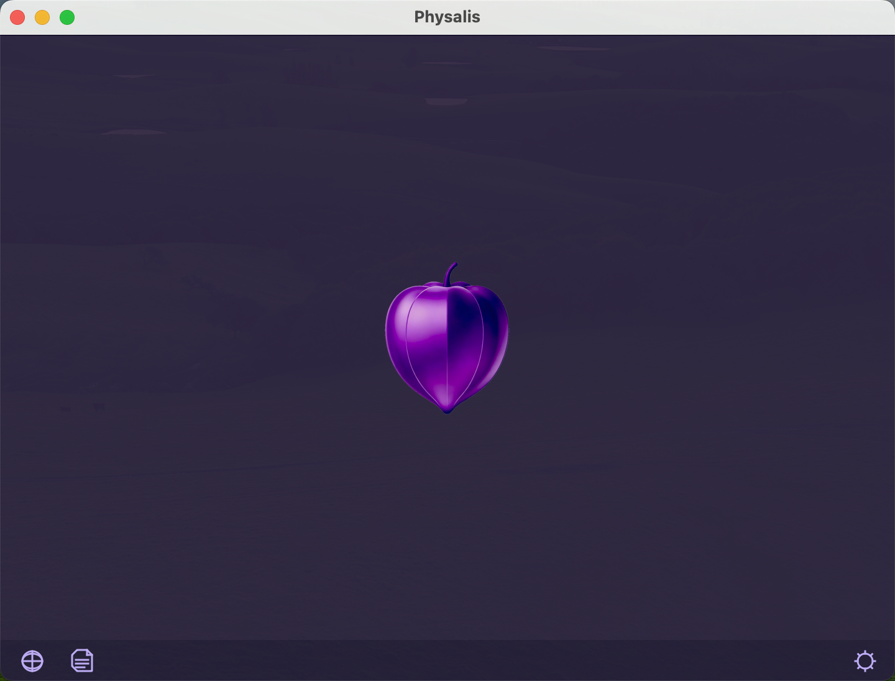
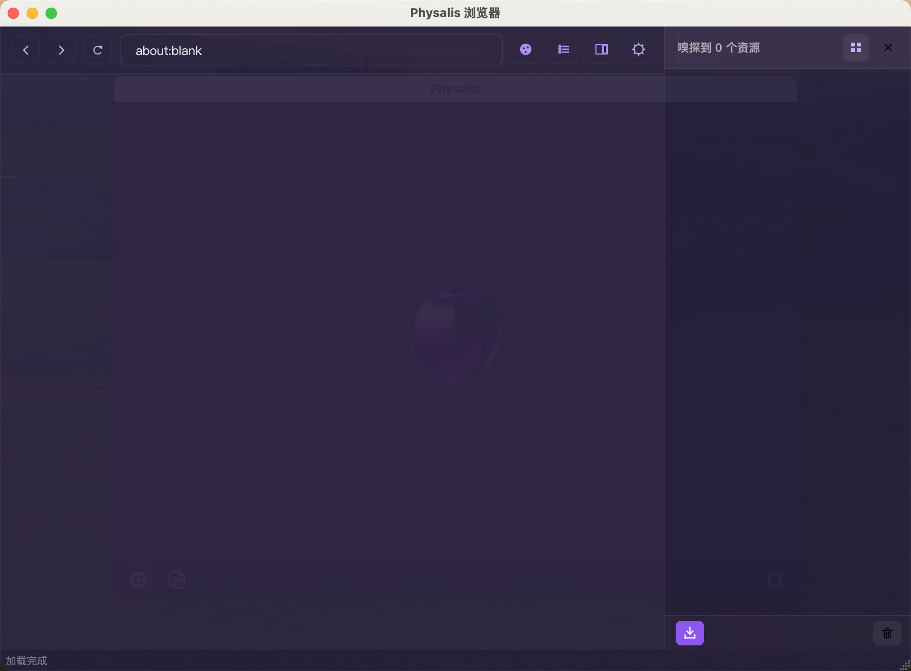

# Physalis

Cross-platform video downloader with embedded browser for URL sniffing.



## 简体中文

跨平台视频下载器，内置浏览器支持视频 URL 嗅探功能。

## Features / 功能特性

| English | 中文 |
|---------|------|
| Embedded browser with video URL sniffing | 内置浏览器，支持视频 URL 嗅探 |
| yt-dlp powered download engine | 基于 yt-dlp 的下载引擎 |
| Cookie management for authenticated content | Cookie 管理，支持需要登录的内容 |
| Cross-platform (macOS/Linux/Windows) | 跨平台支持 (macOS/Linux/Windows) |
| Per-domain title extraction rules | 域名级标题提取规则 |
| Download history persistence | 下载历史持久化 |
| Pause / resume downloads | 暂停 / 恢复下载 |
| Playlist video selection | 播放列表视频选择 |
| Thumbnail extraction for downloads | 下载任务缩略图提取 |
| Sniff panel with list / grid view | 嗅探面板列表 / 网格视图切换 |
| Configurable sniff filters (images, scripts, fonts) | 可配置的嗅探过滤器（图片、脚本、字体） |

## Requirements / 环境要求

- Python 3.10+
- PyQt6 >= 6.6.0
- PyQt6-WebEngine >= 6.6.0
- [yt-dlp](https://github.com/yt-dlp/yt-dlp) — must be on `$PATH` or at `bin/yt-dlp`
- [ffmpeg](https://ffmpeg.org/) — recommended for merging and post-processing

## Installation / 安装

```bash
# Clone the repository
git clone <repo-url>
cd Physalis

# Create virtual environment
python -m venv .venv
source .venv/bin/activate  # Linux/macOS
# or: .venv\Scripts\activate  # Windows

# Install dependencies
pip install -r requirements.txt
```

## Quick Start / 快速开始

```bash
.venv/bin/python main.py
```

## Usage / 使用

1. **Browser Sniffing / 浏览器嗅探**
   - Click the browser button to open the embedded browser
   - Navigate to any video website
   - The sniff panel automatically detects video URLs
   - Click download on individual items or download all
   - Toggle between list and grid view in the sniff panel

2. **URL Paste / URL 粘贴**
   - Paste a video URL directly into the app
   - Single video: starts downloading immediately
   - Playlist: select videos via the selection dialog

3. **Cookie Management / Cookie 管理**
   - Cookies are automatically saved while browsing in the embedded browser
   - Manage cookies per domain via the cookie manager dialog
   - Exported to Netscape cookie format for yt-dlp authentication

4. **Download Control / 下载控制**
   - Pause and resume downloads at any time
   - Retry failed or cancelled downloads
   - Configure max concurrent downloads (1–10)

## Architecture / 架构

```
main.py
 └── app.py (create_app, styles)
      └── ui/main_window.py
           ├── core/downloader.py     # yt-dlp wrapper (QProcess)
           ├── core/sniffer.py        # HTTP request interceptor
           ├── core/config.py         # Settings singleton
           ├── core/cookie_manager.py # Cookie persistence
           ├── core/title_rules.py    # Per-domain title extraction
           ├── core/task.py           # DownloadTask + TaskStatus
           └── ui/browser_window.py   # Embedded browser + sniff panel
```

**Key Components / 主要组件：**

- `MainWindow` — Main download list, status bar, menus
- `BrowserWindow` — Embedded QWebEngineView + SniffPanel, reused across open/close
- `Downloader` — QProcess-based yt-dlp wrapper with probe-then-download flow
- `NetworkSniffer` — QWebEngineUrlRequestInterceptor for media URL detection (runs on Chromium IO thread)
- `Config` — Singleton settings manager with eager persistence
- `CookieManager` — Cookie persistence with debounced JSON storage
- `TitleRuleManager` — Per-domain CSS selector rules for page title extraction

## Configuration / 配置

Settings are stored in `config.json` in the platform config directory:

| Platform | Path |
|----------|------|
| macOS | `~/Library/Application Support/Physalis/` |
| Linux | `~/.config/Physalis/` |
| Windows | `%APPDATA%/Physalis/` |

**Config keys:**

| Key | Default | Description |
|-----|---------|-------------|
| `download_dir` | `~/Downloads/Physalis` | Download directory |
| `max_concurrent` | `3` | Max concurrent downloads (1–10) |
| `preferred_quality` | `best` | Preferred video quality |
| `language` | `zh_CN` | UI language |
| `sniff_filter_types` | `application/json,text/html,...` | Content-Types to filter out from sniff results |
| `filter_empty_type` | `false` | Filter sniffed URLs with no Content-Type |
| `sniff_images` | `false` | Show images in sniff results |
| `sniff_scripts` | `false` | Show scripts/styles in sniff results |
| `sniff_fonts` | `false` | Show fonts in sniff results |

## Building / 构建

### macOS

```bash
./build_macapp.sh
```

Output: `dist/Physalis.app`

**Signing (optional):**
```bash
codesign --force --deep --sign "Developer ID Application: Your Name" dist/Physalis.app
```

**Notarization (requires Apple Developer account):**
```bash
zip -r Physalis.zip Physalis.app
notarytool submit Physalis.zip --apple-id "your@email.com" --password "app-password" --team-id "TEAMID"
```

### Linux (.deb)

```bash
./build_linux.sh
```

Output: `dist/physalis_<version>_amd64.deb`

**Install:**
```bash
sudo dpkg -i dist/physalis_0.1.0_amd64.deb
```

**Uninstall:**
```bash
sudo dpkg -r physalis
```

The package installs the app to `/opt/Physalis/`, creates a `/usr/bin/physalis` launcher, desktop entry, and icons.

Package dependencies: `libgl1`, `libxkbcommon0`, `libxcb-xinerama0`, `libxcb-cursor0` (required), `ffmpeg`, `yt-dlp` (recommended).

## Troubleshooting / 常见问题

**yt-dlp not found / 找不到 yt-dlp**
Place the `yt-dlp` binary at `bin/yt-dlp` in the project root, or ensure it is on `$PATH`.

**Videos fail to download / 下载失败**
Ensure `ffmpeg` is installed — yt-dlp requires it for merging video+audio streams.

**Blank browser page / 浏览器白屏**
On Linux, ensure GPU drivers and `libgl1` are installed. The app sets Chromium GPU flags automatically.

## License

MIT License
